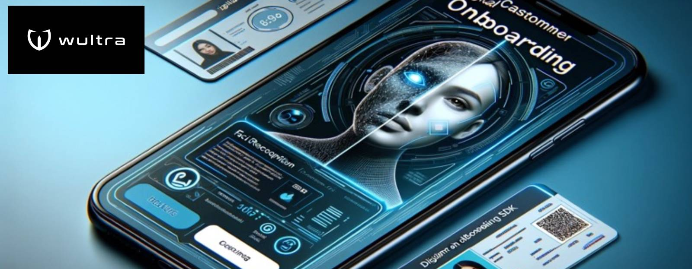

# Wultra Digital Onboarding for Apple Platforms

<!-- begin remove -->

 

 
 
 
 
  
<!-- end -->

<!-- begin box info -->
__Wultra Digital Onboarding__ is an extension SDK for apps using [Wultra Mobile Authentication (PowerAuth)](https://wultra.com/powerauth).
<!-- end -->

## Introduction

Elevate your standard device activation, user login, and request signing scenarios by incorporating facial recognition and document scanning in diverse situations:

- Reclaim access or recover lost credentials through authenticating the user's genuine presence and verifying document validity.
- Reinforce conventional password or PIN-based authentication with an extra layer of security through face recognition.
- Seamlessly onboard new customers into your systems, authenticating them with identification cards and facial scans for access to your app.

### Minimal requirements

| Requuirement |      Value          |  
|--------------|---------------------|
| Min. system  |  __iOS 13__         | 
| Integration  |  __Cocoapods, SPM__ | 

### Other resources

We also provide an [Android version of this library](https://github.com/wultra/digital-onboarding-android).

## What will you need before the implementation

<!-- begin box info -->
The Wultra Digital Onboarding SDK functions as an extension of Wultra Mobile Authentication that is required.
<!-- end -->

Before initiating the integration, it's essential to ensure that your server environment is prepared with appropriately configured services capable of managing user verification and onboarding, seamlessly connecting to your systems.

Given the unique characteristics of each customer system, the utilization of this SDK may vary. To accurately outline the user verification process, we recommend consulting with our technical team for tailored guidance.

## Document ORC and face verification

We seamlessly incorporate a range of industry-leading solutions for document scanning, ensuring versatility and effectiveness in your operations.

- iProov for genuine presence
- Innovatrics for document scanning and genuine presence
- ZenID for document scanning

Our dedicated technical and sales representatives are available to guide you in selecting the optimal solution that aligns perfectly with your specific needs.

## Documentation

<!-- begin box warning -->
Please be aware that the scenarios outlined in the documentation are illustrative examples. Your user flow and implementation may vary based on your specific requirements and circumstances.
<!-- end -->

The documentation is available at the [Wultra Developer Portal](https://developers.wultra.com/components/digital-onboarding-apple) or inside the [docs folder](docs).

## License

All sources are licensed using the Apache 2.0 license.

## Contact

If you need any assistance, do not hesitate to drop us a line at [hello@wultra.com](mailto:hello@wultra.com) or our official [wultra.com/discord](https://wultra.com/discord) channel.

### Security Disclosure

If you believe you have identified a security vulnerability with Wultra Digital Onboarding, you should report it as soon as possible via email to [support@wultra.com](mailto:support@wultra.com). Please do not post it to a public issue tracker.