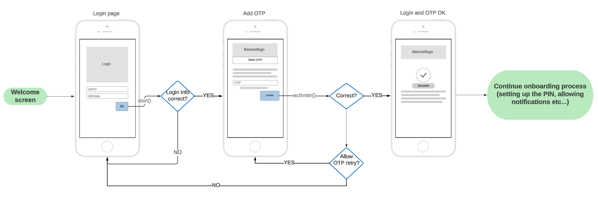

# Device Activation with `WDOActivationService`

With `WDOActivationService` you can onboard PowerAuth with just a piece of user information like his email, phone number, or login name.

PowerAuth enrolled in such a way will need [further user verification](Verifying-User.md) until fully operational (able to sign operations).

## Example app flow

<p align="center"></p>

## Creating an instance

To create an instance you will need a `PowerAuthSDK` instance that is ready to be activated or a `WPNNetworkingService` with such a `PowerAuthSDK` instance. Optionally, you can choose if the activation process will persist between instance re-creation (for example app restart).

<!-- begin box info -->
[Documentation for `PowerAuthSDK`](https://github.com/wultra/powerauth-mobile-sdk).  
[Documentation for `WPNNetworkingService`](https://github.com/wultra/networking-apple/).
<!-- end -->


Example with `PowerAuthSDK` instance:

```swift
let powerAuth = PowerAuthSDK(configuration: ....)
let activationService = WDOActivationService(
    powerAuth: powerAuth,
    config: WPNConfig(baseUrl: "https://sever.my/path/"),
    canRestoreSession: true
)
```

Example with `WPNNetworkingService ` instance:

```swift
let powerAuth = PowerAuthSDK(configuration: ....)
let networking = WPNNetworkingService(
    powerAuth: powerAuth, // configured PowerAuthSDK instance
    config: WPNConfig(baseUrl: "https://sever.my/path/"),
    serviceName: "MyProjectNetworkingService", // for better debugging
    acceptLanguage: "en" // more info in "Language Configuration" docs section
)
let activationService = WDOActivationService(
    powerAuth: powerAuth,
    config: WPNConfig(baseUrl: "https://sever.my/path/"),
    canRestoreSession: true
)

```

## Retrieving the status

To figure out if the activation process was already started and what is the status, you can use `hasActiveProcess`.

```swift
/// If the activation process is in progress.
///
/// Note that even if this property is `true` it can be already discontinued on the server.
/// Calling `status(completion:)` for example after the app is launched in this case is recommended.
public var hasActiveProcess: Bool { get }
```

If the process was started, you can verify its status by calling the `status` function. You can show an appropriate UI to the user based on this status.

```swift
/// Retrieves status of the onboarding activation.
///
/// - Parameter completion: Callback with the result.
public func status(completion: @escaping (Result<Status, WPNError>) -> Void)
```

`Status` possible values.

```swift
enum Status {
    /// Activation is in progress. Continue with the `activate()`.
    case activationInProgress
    /// Activation was already finished, now waiting for the user verification. Use `WDOVerificationService` to fully activate the PowerAuthSDK instance.
    case verificationInProgress
    /// Activation failed, start over.
    case failed
    /// Both activation and verification were finished and the user was fully activated.
    case finished
}
```

#### Example status check after app startup

```swift
class MyUserService {
    // prepared service
    private var activationService: WDOActivationService!
    
    func verifyStatus() {
        guard activationService.hasActiveProcess else {
            // no active process, show
            return
        }
        
        activationService.status { result in
            switch result {
            case .success(let success):
                switch success {
                case .activationInProgress:
                    // activation is in progress, continue with OTP and `activate` method
                    break
                case .verificationInProgress:
                    // verification is in progress, continue with WDOVerificationService
                    break
                case .finished:
                    // the process is finished and PowerAuthSDK instance activated
                    // show PIN login or other "default activated screen"
                    break
                case .failed:
                    // the activation failed (for example expired or was removed from the server),
                    // start again
                break
                }
            case .failure(let failure):
                // handle failure (internet not working, server down, etc..)
                break
            }
        }
    }
}

```

## Starting the process

To start the activation process, you can use any credentials that are sufficient to you that can identify the user.

Often, such data are user email, phone number, or userID with a combination of date of birth. The definition of such data is up to your server implementation and requirements.

To start the activation, use the `start` function.

```swift
/// Start onboarding activation with user credentials.
/// 
/// - Parameters:
///   - credentials: Codable object with credentials. Which credentials are needed should be provided by a system/backend provider.
///   - completion: Callback with the result.
public func start<T: Codable>(credentials: T, completion: @escaping (Result<Void, WPNError>) -> Void
```

### Example

```swift
struct UserData: Codable {
    let userID: String
    let birthDate: String
}

class MyUserService {
    // prepared service
    private var activationService: WDOActivationService!
    
    func startActivation(id: String, bday: String) {
        let data = UserData(userID: id, birthDate: bday)
        activationService.start(credentials: data) { result in
            switch result {
            case .success:
                // success, continue with `activate()`
                // at this moment, the `hasActiveProcess` starts return true
                break
            case .failure(let error):
                // show error to the user
                break
            }
        }
    }
}
```

## Creating the activation

To activate the user (activating the `PowerAuthSDK` instance), data retrieved from the process start can be used with additional `OTP`. The OTP is usually sent via SMS, email, or other channel.

Use the `activate` function to create the activation.

```swift
/// Activate the PowerAuthSDK instance that was passed in the initializer.
///
/// - Parameters:
///   - otp: OTP provided by user.
///   - activationName: Name of the activation. Device name by default (usually something like John's iPhone or similar).
///   - completion: Callback with the result.
public func activate(
    otp: String,
    activationName: String = UIDevice.current.name,
    completion: @escaping (Result<PowerAuthActivationResult, WPNError>) -> Void
)
```

Example implementation:

```swift
class MyUserService {
    // prepared service
    private var activationService: WDOActivationService!
    
    func activate(smsOTP: String) {
        activationService.activate(otp: smsOTP) { result in
            switch result {
            case .success(let resultData):
                // PowerAuthSDK instance was activated.
                // At this moment, navigate the user to
                // the PIN keyboard to finish the PowerAuthSDK initialization.
                // For more information, follow the PowerAuthSDK documentation.
                break
            case .failure(let failure):
                if failure.allowOnboardingOtpRetry {
                    // User entered the wrong OTP, prompt for a new one.
                    // Remaining OTP attempts count: failure.onboardingOtpRemainingAttempts
                } else {
                    // show error UI
                }
            }
        }
    }
}
```

## Canceling the process

To cancel the process, just call the `cancel` function.

```swift
/// Cancel the activation process.
///
/// - Parameters:
///   - forceCancel: When true, the process will be canceled in the SDK even when fails on backend. `true` by default.
///   - completion: Callback with the result.
public func cancel(
    forceCancel: Bool,
    completion: @escaping (Result<Void, WPNError>) -> Void
)
```

## OTP resend

In some cases, you need to resent the OTP:  
 - OTP was not received by the user (for example when the email ends in the spam folder).  
 - OTP expired. 

 For such cases, use `resendOTP` function.
 
 ```swift
/// OTP resend request.
///
/// - Parameter completion: Callback with the result.
public func resendOTP(completion: @escaping (Result<Void, WPNError>) -> Void)
 ```
 
## Errors

All functions that can return an error in the completion are `WPNError` type - more about these errors can be found in [the networking library documentation](https://github.com/wultra/networking-apple/).

There are 3 additional custom errors that this service is adding:

| Custom `WPNErrorReason` |      Description          |  
|--------------|---------------------|
| `wdo_activation_inProgress`  |  Activation is already in progress.         | 
| `wdo_activation_notRunning`  |  Activation was not started. | 
| `wdo_activation_cannotActivate`  |  PowerAuth instance cannot start the activation (probably already activated). | 

## Read next
- [Verifying User With Document Scan And Genuine Presence Check](Verifying-User.md)